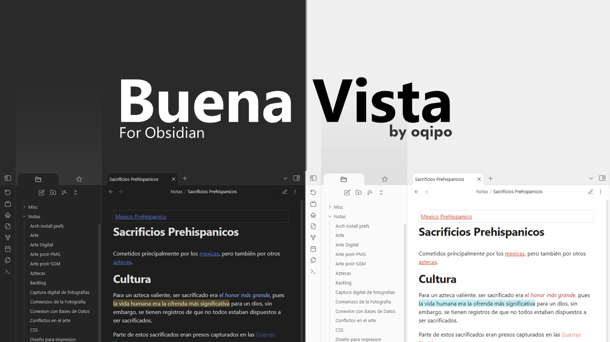
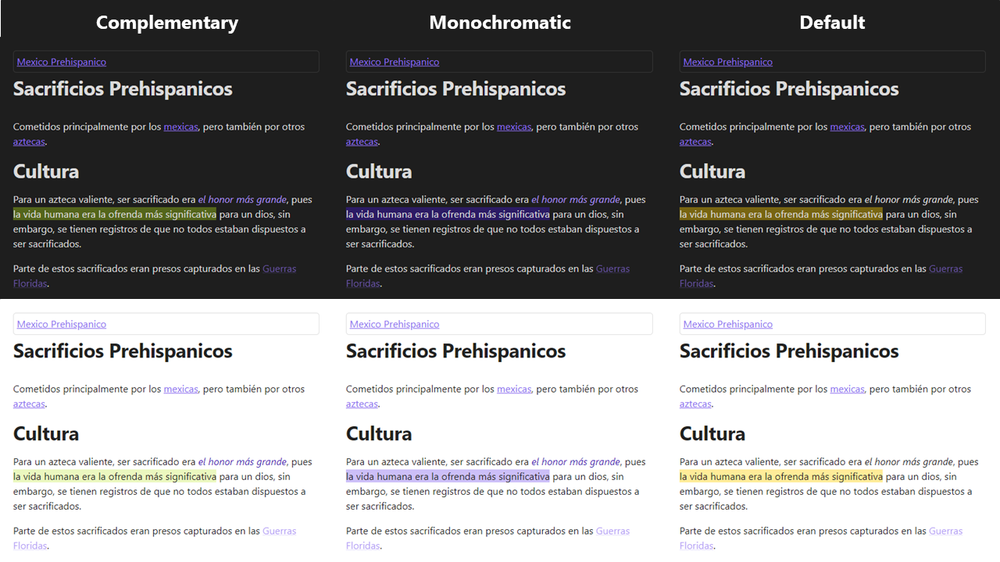
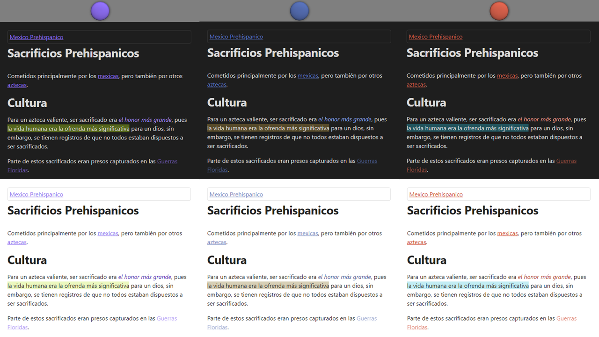
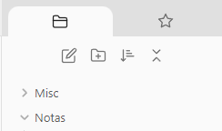
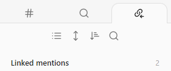

# Buena Vista Theme
Small Tweaks for obsidian

Buena Vista is a configurable theme for Obsidian that provides small _quality-of-life_ and aesthetic improvements.

## Features

### Colour modes

Different modes can be accessed with the [Style Settings](https://github.com/mgmeyers/obsidian-style-settings) plugin.

Still works with Obsidian's Accent colour

### Affected plugins

Plugins that received some visual changes:

- Slides (built-in)
- Outline (built-in)
- [Style Settings](https://github.com/mgmeyers/obsidian-style-settings)
- [Kanban](https://github.com/mgmeyers/obsidian-kanban)
- [Breadcrumbs](https://github.com/SkepticMystic/breadcrumbs)

### Tweaks

- **Embedded notes don't take as much space** when they have too much content.
    - Embedded note **titles are smaller**.
- Quotes and callouts have a more consistent style.
- Callouts are slightly highlighted in source mode.
- Borders are removed unless draggable or needed for visual clarity.
- Sidebar tabs are bigger and look more like tabs.

|||
| :---: | :---: |
|Consistent style|Bigger click targets!|
